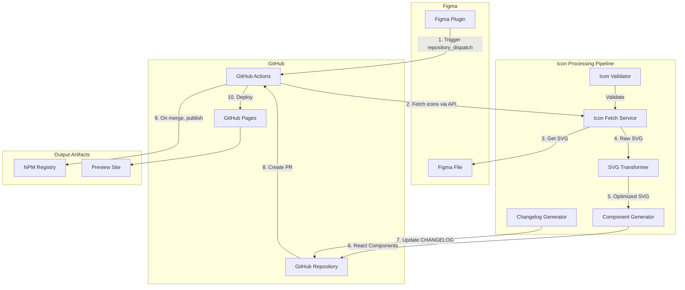

# Design Document: Figma Icon Automation

## Overview

本系统实现从 Figma 设计到 NPM 发布的全自动化图标工作流。整体架构采用事件驱动模式，由 Figma 插件触发，通过 GitHub Actions 编排各个处理步骤，最终输出多格式的图标资源并发布到 NPM。

系统分为四个主要模块：

1. **Figma Plugin** - 设计师交互入口
2. **Icon Processing Pipeline** - 图标处理流水线（获取、优化、生成）
3. **GitHub Actions Orchestrator** - 工作流编排
4. **Output Artifacts** - 输出产物（NPM 包、预览网站）

## Architecture



## Components and Interfaces

### 1. Figma Plugin

Figma 插件使用 Figma Plugin API 开发，提供用户界面和 GitHub API 交互能力。

```typescript
// Plugin Configuration Interface
interface PluginConfig {
  githubRepo: string // e.g., "org/icon-library"
  githubToken: string // Personal Access Token
  figmaFileKey: string // Auto-detected from current file
  defaultBranch: string // Default: "main"
}

// Sync Request Payload
interface SyncRequest {
  version: string // Semantic version, e.g., "1.2.0"
  message: string // Update description
  fileKey: string // Figma file key
  timestamp: string // ISO timestamp
}

// Plugin UI State
interface PluginUIState {
  config: PluginConfig | null
  isConfigured: boolean
  isSyncing: boolean
  lastSyncResult: SyncResult | null
}

interface SyncResult {
  success: boolean
  prUrl?: string
  error?: string
}
```

**Plugin 核心流程：**

```typescript
// Pseudocode for plugin main flow
async function handleSync(request: SyncRequest): Promise<SyncResult> {
  // 1. Validate configuration
  const config = await loadConfig()
  if (!config) throw new Error('Plugin not configured')

  // 2. Trigger GitHub Actions via repository_dispatch
  const response = await triggerGitHubAction(config, {
    event_type: 'icon_sync',
    client_payload: {
      version: request.version,
      message: request.message,
      figma_file_key: request.fileKey,
      triggered_at: request.timestamp,
    },
  })

  // 3. Return result with PR link
  return {
    success: true,
    prUrl: `https://github.com/${config.githubRepo}/pulls`,
  }
}
```

### 2. Icon Fetch Service

从 Figma API 获取图标 SVG 数据的服务模块。

```typescript
// Figma API Response Types
interface FigmaComponent {
  id: string
  name: string
  type: 'COMPONENT'
  absoluteBoundingBox: {
    width: number
    height: number
  }
}

interface FigmaFileResponse {
  document: {
    children: FigmaNode[]
  }
  components: Record<string, FigmaComponent>
}

// Icon Metadata
interface IconMetadata {
  id: string
  name: string
  originalName: string // Name in Figma
  normalizedName: string // PascalCase name
  width: number
  height: number
  svgContent?: string
}

// Icon Manifest
interface IconManifest {
  version: string
  generatedAt: string
  totalCount: number
  icons: IconMetadata[]
}
```

**Fetch Service 核心逻辑：**

```typescript
// Pseudocode for icon fetching
async function fetchIcons(
  fileKey: string,
  token: string
): Promise<IconManifest> {
  // 1. Get file structure
  const fileData = await figmaApi.getFile(fileKey, token)

  // 2. Extract component IDs
  const componentIds = extractComponentIds(fileData.components)

  // 3. Batch export SVGs (Figma API supports batch export)
  const svgUrls = await figmaApi.getImages(fileKey, componentIds, {
    format: 'svg',
    svg_include_id: false,
    svg_simplify_stroke: true,
  })

  // 4. Download SVG content
  const icons = await Promise.all(
    componentIds.map(async (id) => {
      const svgContent = await downloadSvg(svgUrls[id])
      return buildIconMetadata(fileData.components[id], svgContent)
    })
  )

  return {
    version: '1.0.0',
    generatedAt: new Date().toISOString(),
    totalCount: icons.length,
    icons,
  }
}
```

### 3. SVG Transformer

使用 SVGO 优化 SVG 并转换为 React 兼容格式。

```typescript
// SVGO Configuration
interface SvgoConfig {
  plugins: SvgoPlugin[]
}

// Transform Options
interface TransformOptions {
  replaceColors: boolean // Replace colors with currentColor
  removeSize: boolean // Remove width/height attributes
  removeFill: boolean // Remove fill attributes for color inheritance
  addViewBox: boolean // Ensure viewBox is present
}

// Transform Result
interface TransformResult {
  originalSize: number // Original SVG size in bytes
  optimizedSize: number // Optimized SVG size in bytes
  svgContent: string // Optimized SVG string
  jsxContent: string // JSX-compatible SVG string
}
```

**SVGO 配置：**

```typescript
const svgoConfig: SvgoConfig = {
  plugins: [
    'preset-default',
    'removeDimensions',
    'removeXMLNS',
    {
      name: 'convertColors',
      params: {
        currentColor: true,
      },
    },
    {
      name: 'removeAttrs',
      params: {
        attrs: ['fill', 'stroke'],
      },
    },
    {
      name: 'addAttributesToSVGElement',
      params: {
        attributes: [{ fill: 'currentColor' }],
      },
    },
  ],
}
```

**Transform 核心逻辑：**

```typescript
// Pseudocode for SVG transformation
function transformSvg(
  svgContent: string,
  options: TransformOptions
): TransformResult {
  // 1. Optimize with SVGO
  const optimized = svgo.optimize(svgContent, svgoConfig)

  // 2. Convert to JSX format
  const jsxContent = convertToJsx(optimized.data)

  return {
    originalSize: svgContent.length,
    optimizedSize: optimized.data.length,
    svgContent: optimized.data,
    jsxContent,
  }
}

function convertToJsx(svg: string): string {
  // Convert SVG attributes to JSX format
  return svg
    .replace(/class=/g, 'className=')
    .replace(/stroke-width=/g, 'strokeWidth=')
    .replace(/stroke-linecap=/g, 'strokeLinecap=')
    .replace(/stroke-linejoin=/g, 'strokeLinejoin=')
    .replace(/fill-rule=/g, 'fillRule=')
    .replace(/clip-rule=/g, 'clipRule=')
    .replace(/clip-path=/g, 'clipPath=')
}
```

### 4. Component Generator

生成 TypeScript React 组件代码。

```typescript
// Component Props Interface
interface IconProps {
  size?: number | string
  color?: string
  className?: string
  style?: React.CSSProperties
  // SVG native attributes
  [key: string]: any
}

// Generated Component Template
interface ComponentTemplate {
  componentName: string // e.g., "IconArrowRight"
  fileName: string // e.g., "IconArrowRight.tsx"
  content: string // Full component code
  types: string // Type definitions
}

// Generation Config
interface GeneratorConfig {
  outputDir: string
  iconPrefix: string // Default: "Icon"
  typescript: boolean
  generateTypes: boolean
  generateIndex: boolean
}
```

**组件模板：**

```typescript
// Component template generator
function generateComponent(
  icon: IconMetadata,
  jsxContent: string
): ComponentTemplate {
  const componentName = `Icon${toPascalCase(icon.name)}`

  const content = `
import React, { forwardRef, SVGProps } from 'react';

export interface ${componentName}Props extends SVGProps<SVGSVGElement> {
  size?: number | string;
  color?: string;
}

export const ${componentName} = forwardRef<SVGSVGElement, ${componentName}Props>(
  ({ size = 24, color = 'currentColor', className, style, ...props }, ref) => {
    return (
      ${jsxContent
        .replace('<svg', '<svg ref={ref}')
        .replace('width="24"', 'width={size}')
        .replace('height="24"', 'height={size}')
        .replace('fill="currentColor"', 'fill={color}')
        .replace('>', ` className={className} style={style} {...props}>`)}
    );
  }
);

${componentName}.displayName = '${componentName}';

export default ${componentName};
`

  return {
    componentName,
    fileName: `${componentName}.tsx`,
    content,
    types: `export { ${componentName}, ${componentName}Props } from './${componentName}';`,
  }
}
```

**Index 文件生成：**

```typescript
function generateIndexFile(components: ComponentTemplate[]): string {
  const exports = components
    .map(
      (c) =>
        `export { ${c.componentName}, type ${c.componentName}Props } from './icons/${c.componentName}';`
    )
    .join('\n')

  const allIconsExport = `
export const allIcons = {
  ${components.map((c) => c.componentName).join(',\n  ')}
} as const;

export type IconName = keyof typeof allIcons;
`

  return exports + '\n\n' + allIconsExport
}
```

### 5. Icon Validator

图标规范校验模块。

```typescript
// Validation Rules
interface ValidationRules {
  allowedSizes: number[] // e.g., [16, 20, 24, 32]
  namingPattern: RegExp // e.g., /^[a-z][a-z0-9-]*$/
  maxFileSize: number // Max SVG size in bytes
  requiredAttributes: string[]
  forbiddenElements: string[]
}

// Validation Result
interface ValidationResult {
  isValid: boolean
  errors: ValidationError[]
  warnings: ValidationWarning[]
}

interface ValidationError {
  iconName: string
  rule: string
  message: string
  severity: 'error' | 'warning'
}
```

**校验逻辑：**

```typescript
function validateIcon(
  icon: IconMetadata,
  rules: ValidationRules
): ValidationResult {
  const errors: ValidationError[] = []
  const warnings: ValidationWarning[] = []

  // Check size
  if (
    !rules.allowedSizes.includes(icon.width) ||
    !rules.allowedSizes.includes(icon.height)
  ) {
    errors.push({
      iconName: icon.name,
      rule: 'size',
      message: `Icon size ${icon.width}x${icon.height} not in allowed sizes`,
      severity: 'error',
    })
  }

  // Check naming
  if (!rules.namingPattern.test(icon.originalName)) {
    warnings.push({
      iconName: icon.name,
      rule: 'naming',
      message: `Icon name "${icon.originalName}" doesn't match naming convention`,
      severity: 'warning',
    })
  }

  // Check for forbidden elements
  const forbiddenFound = rules.forbiddenElements.filter((el) =>
    icon.svgContent?.includes(`<${el}`)
  )
  if (forbiddenFound.length > 0) {
    errors.push({
      iconName: icon.name,
      rule: 'forbidden-elements',
      message: `Icon contains forbidden elements: ${forbiddenFound.join(', ')}`,
      severity: 'error',
    })
  }

  return {
    isValid: errors.filter((e) => e.severity === 'error').length === 0,
    errors,
    warnings,
  }
}
```

### 6. Changelog Generator

自动生成变更日志。

```typescript
// Changelog Entry
interface ChangelogEntry {
  version: string
  date: string
  message: string
  changes: {
    added: string[]
    modified: string[]
    removed: string[]
  }
}

// Diff Result
interface IconDiff {
  added: IconMetadata[]
  modified: IconMetadata[]
  removed: IconMetadata[]
}
```

**Changelog 生成逻辑：**

```typescript
function generateChangelog(
  currentManifest: IconManifest,
  previousManifest: IconManifest,
  version: string,
  message: string
): string {
  const diff = computeDiff(currentManifest, previousManifest)

  const entry = `
## [${version}] - ${new Date().toISOString().split('T')[0]}

${message}

### Added
${diff.added.map((i) => `- ${i.normalizedName}`).join('\n') || '- None'}

### Modified
${diff.modified.map((i) => `- ${i.normalizedName}`).join('\n') || '- None'}

### Removed
${diff.removed.map((i) => `- ${i.normalizedName}`).join('\n') || '- None'}
`

  return entry
}

function computeDiff(current: IconManifest, previous: IconManifest): IconDiff {
  const currentNames = new Set(current.icons.map((i) => i.normalizedName))
  const previousNames = new Set(previous.icons.map((i) => i.normalizedName))

  return {
    added: current.icons.filter((i) => !previousNames.has(i.normalizedName)),
    removed: previous.icons.filter((i) => !currentNames.has(i.normalizedName)),
    modified: current.icons.filter((i) => {
      const prev = previous.icons.find(
        (p) => p.normalizedName === i.normalizedName
      )
      return prev && prev.svgContent !== i.svgContent
    }),
  }
}
```

### 7. Multi-Format Output Generator

生成多种格式的输出文件。

```typescript
// Output Formats
interface OutputFormats {
  react: boolean // React components
  svg: boolean // Raw SVG files
  sprite: boolean // SVG sprite
  json: boolean // JSON metadata
}

// SVG Sprite Structure
interface SvgSprite {
  content: string // Full sprite SVG
  symbols: SpriteSymbol[]
}

interface SpriteSymbol {
  id: string
  viewBox: string
  content: string
}
```

**Sprite 生成：**

```typescript
function generateSprite(icons: IconMetadata[]): SvgSprite {
  const symbols = icons.map((icon) => ({
    id: icon.normalizedName.toLowerCase(),
    viewBox: '0 0 24 24',
    content: extractSvgContent(icon.svgContent!),
  }))

  const spriteContent = `
<svg xmlns="http://www.w3.org/2000/svg" style="display: none;">
  ${symbols
    .map(
      (s) => `
  <symbol id="${s.id}" viewBox="${s.viewBox}">
    ${s.content}
  </symbol>`
    )
    .join('\n')}
</svg>
`

  return { content: spriteContent, symbols }
}

// JSON Metadata
function generateMetadataJson(manifest: IconManifest): string {
  return JSON.stringify(
    {
      version: manifest.version,
      generatedAt: manifest.generatedAt,
      icons: manifest.icons.map((i) => ({
        name: i.normalizedName,
        originalName: i.originalName,
        size: { width: i.width, height: i.height },
      })),
    },
    null,
    2
  )
}
```

## Data Models

### Project Structure

```
icon-library/
├── .github/
│   └── workflows/
│       ├── sync-icons.yml       # Icon sync workflow
│       └── publish.yml          # NPM publish workflow
├── src/
│   ├── icons/                   # Generated icon components
│   │   ├── IconArrowRight.tsx
│   │   ├── IconCheck.tsx
│   │   └── ...
│   ├── index.ts                 # Main export file
│   └── types.ts                 # Shared types
├── svg/                         # Raw SVG files
│   ├── arrow-right.svg
│   └── ...
├── sprite/
│   └── icons.svg                # SVG sprite file
├── dist/                        # Compiled output
│   ├── esm/                     # ES Modules
│   ├── cjs/                     # CommonJS
│   └── types/                   # Type definitions
├── docs/                        # Preview site source
│   └── index.html
├── scripts/
│   ├── fetch-icons.ts           # Icon fetch script
│   ├── transform-svg.ts         # SVG transform script
│   ├── generate-components.ts   # Component generator
│   └── generate-changelog.ts    # Changelog generator
├── icons.json                   # Icon metadata
├── CHANGELOG.md
├── package.json
├── tsconfig.json
└── README.md
```

### GitHub Actions Workflow

**sync-icons.yml:**

```yaml
name: Sync Icons from Figma

on:
  repository_dispatch:
    types: [icon_sync]

env:
  FIGMA_TOKEN: ${{ secrets.FIGMA_TOKEN }}
  FIGMA_FILE_KEY: ${{ github.event.client_payload.figma_file_key }}
  VERSION: ${{ github.event.client_payload.version }}
  MESSAGE: ${{ github.event.client_payload.message }}

jobs:
  sync:
    runs-on: ubuntu-latest
    steps:
      - uses: actions/checkout@v4

      - uses: actions/setup-node@v4
        with:
          node-version: '20'

      - name: Install dependencies
        run: npm ci

      - name: Fetch icons from Figma
        run: npm run fetch-icons

      - name: Validate icons
        run: npm run validate-icons

      - name: Transform SVGs
        run: npm run transform-svg

      - name: Generate React components
        run: npm run generate-components

      - name: Generate sprite and metadata
        run: npm run generate-outputs

      - name: Update changelog
        run: npm run generate-changelog

      - name: Update version
        run: npm version ${{ env.VERSION }} --no-git-tag-version

      - name: Create Pull Request
        uses: peter-evans/create-pull-request@v5
        with:
          token: ${{ secrets.GITHUB_TOKEN }}
          commit-message: 'feat(icons): ${{ env.MESSAGE }}'
          title: '🎨 Icon Update: ${{ env.VERSION }}'
          body: |
            ## Icon Update

            **Version:** ${{ env.VERSION }}
            **Message:** ${{ env.MESSAGE }}

            This PR was automatically generated by the Figma Icon Automation workflow.
          branch: icon-update/${{ env.VERSION }}
          base: main
```

**publish.yml:**

```yaml
name: Publish to NPM

on:
  push:
    branches: [main]
    paths:
      - 'src/**'
      - 'package.json'

jobs:
  publish:
    runs-on: ubuntu-latest
    steps:
      - uses: actions/checkout@v4

      - uses: actions/setup-node@v4
        with:
          node-version: '20'
          registry-url: 'https://registry.npmjs.org'

      - name: Install dependencies
        run: npm ci

      - name: Build
        run: npm run build

      - name: Publish to NPM
        run: npm publish --access public
        env:
          NODE_AUTH_TOKEN: ${{ secrets.NPM_TOKEN }}

      - name: Create GitHub Release
        uses: softprops/action-gh-release@v1
        with:
          tag_name: v${{ steps.version.outputs.version }}
          generate_release_notes: true

  deploy-docs:
    needs: publish
    runs-on: ubuntu-latest
    steps:
      - uses: actions/checkout@v4

      - name: Build preview site
        run: npm run build:docs

      - name: Deploy to GitHub Pages
        uses: peaceiris/actions-gh-pages@v3
        with:
          github_token: ${{ secrets.GITHUB_TOKEN }}
          publish_dir: ./docs/dist
```

### Package.json Configuration

```json
{
  "name": "@zleap/icons",
  "version": "1.0.0",
  "description": "Icon library auto-generated from Figma",
  "main": "dist/cjs/index.js",
  "module": "dist/esm/index.js",
  "types": "dist/types/index.d.ts",
  "sideEffects": false,
  "exports": {
    ".": {
      "import": "./dist/esm/index.js",
      "require": "./dist/cjs/index.js",
      "types": "./dist/types/index.d.ts"
    },
    "./svg/*": "./svg/*",
    "./sprite": "./sprite/icons.svg"
  },
  "files": ["dist", "svg", "sprite", "icons.json"],
  "scripts": {
    "fetch-icons": "tsx scripts/fetch-icons.ts",
    "validate-icons": "tsx scripts/validate-icons.ts",
    "transform-svg": "tsx scripts/transform-svg.ts",
    "generate-components": "tsx scripts/generate-components.ts",
    "generate-outputs": "tsx scripts/generate-outputs.ts",
    "generate-changelog": "tsx scripts/generate-changelog.ts",
    "build": "npm run build:esm && npm run build:cjs && npm run build:types",
    "build:esm": "tsc -p tsconfig.esm.json",
    "build:cjs": "tsc -p tsconfig.cjs.json",
    "build:types": "tsc -p tsconfig.types.json",
    "build:docs": "vite build --config vite.docs.config.ts"
  },
  "peerDependencies": {
    "react": ">=16.8.0"
  },
  "devDependencies": {
    "@types/react": "^18.2.0",
    "react": "^18.2.0",
    "svgo": "^3.0.0",
    "tsx": "^4.0.0",
    "typescript": "^5.0.0",
    "vite": "^5.0.0"
  }
}
```

## Correctness Properties

_A property is a characteristic or behavior that should hold true across all valid executions of a system-essentially, a formal statement about what the system should do. Properties serve as the bridge between human-readable specifications and machine-verifiable correctness guarantees._

### Property 1: Icon Component Filtering

_For any_ list of Figma components containing mixed types (frames, groups, components), the Icon_Sync_Service filter function SHALL return only components that are of type "COMPONENT" and match the icon naming convention.

**Validates: Requirements 2.2**

### Property 2: Icon Manifest Completeness

_For any_ set of successfully exported icons, the generated IconManifest SHALL contain exactly one entry for each icon with all required metadata fields (id, name, normalizedName, width, height).

**Validates: Requirements 2.6**

### Property 3: SVG Optimization Invariants

_For any_ valid SVG input, after SVG_Transformer processing:

- The output size SHALL be less than or equal to the input size
- The output SHALL NOT contain width/height attributes
- All color values SHALL be replaced with "currentColor"
- All attribute names SHALL be in JSX camelCase format (e.g., strokeWidth, fillRule)

**Validates: Requirements 3.1, 3.2, 3.3, 3.4, 3.5**

### Property 4: SVG Structure Round-Trip

_For any_ valid SVG input, parsing the optimized SVG output SHALL produce a DOM structure with equivalent visual elements (same paths, shapes, and structure), even if attributes have been modified.

**Validates: Requirements 3.6**

### Property 5: Component Name Transformation

_For any_ icon name string, the Component_Generator SHALL produce a component name that:

- Starts with "Icon" prefix
- Is in PascalCase format
- Contains only alphanumeric characters
- Preserves the semantic meaning of the original name

**Validates: Requirements 4.3**

### Property 6: Generated Component Structure

_For any_ generated React component:

- It SHALL be a valid TypeScript function component
- It SHALL accept size, color, and className props
- It SHALL forward ref to the SVG element
- It SHALL spread additional props to the SVG element
- It SHALL have corresponding type definitions exported

**Validates: Requirements 4.1, 4.2, 4.4, 4.6**

### Property 7: Index Export Completeness

_For any_ set of generated icon components, the index.ts file SHALL export every component and its corresponding Props type, with no missing or duplicate exports.

**Validates: Requirements 4.5**

### Property 8: Icon Component Props Behavior

_For any_ icon component instance:

- Setting size prop SHALL update both width and height of the SVG
- Setting color prop SHALL update the fill/stroke color
- Passing arbitrary SVG attributes SHALL forward them to the SVG element

**Validates: Requirements 7.2, 7.3, 7.4**

### Property 9: Search Filter Accuracy

_For any_ search query string and icon list, the Preview_Site filter function SHALL return only icons whose names contain the search query (case-insensitive), with no false positives or false negatives.

**Validates: Requirements 8.3**

### Property 10: Changelog Entry Format

_For any_ version release, the generated changelog entry SHALL:

- Be grouped under the correct version number
- Include the release date in ISO format
- Categorize changes into added/modified/removed sections
- Include the designer's update message

**Validates: Requirements 10.2, 10.3, 10.4, 10.5**

### Property 11: Multi-Format Output Consistency

_For any_ icon in the library:

- A React component file SHALL exist in src/icons/
- A raw SVG file SHALL exist in svg/
- An entry SHALL exist in the SVG sprite file
- An entry SHALL exist in icons.json metadata

**Validates: Requirements 11.1, 11.2, 11.3, 11.5**

### Property 12: Icon Validation Rules

_For any_ icon being validated:

- Size validation SHALL correctly identify icons outside allowed dimensions
- Name validation SHALL correctly identify names not matching the pattern
- SVG feature detection SHALL correctly identify forbidden elements

**Validates: Requirements 12.1, 12.2, 12.4**

### Property 13: Semantic Version Suggestion

_For any_ icon diff between versions:

- If only icons are added → suggest minor version bump
- If icons are removed or breaking changes exist → suggest major version bump
- If only icons are modified → suggest patch version bump

**Validates: Requirements 13.1, 13.2, 13.3, 13.4**

## Error Handling

### Figma API Errors

| Error Type     | Handling Strategy                                         |
| -------------- | --------------------------------------------------------- |
| Invalid Token  | Display clear error message, prompt for token refresh     |
| Rate Limit     | Implement exponential backoff, retry up to 3 times        |
| File Not Found | Display error with file key, suggest checking permissions |
| Network Error  | Retry with timeout, display connection error              |

### SVG Processing Errors

| Error Type           | Handling Strategy                                |
| -------------------- | ------------------------------------------------ |
| Invalid SVG          | Log error, skip icon, continue with others       |
| Unsupported Features | Generate warning, attempt fallback processing    |
| Parse Error          | Log detailed error, include in validation report |

### GitHub Actions Errors

| Error Type            | Handling Strategy                       |
| --------------------- | --------------------------------------- |
| Authentication Failed | Fail workflow, send notification        |
| PR Creation Failed    | Retry once, then fail with detailed log |
| NPM Publish Failed    | Rollback version, send notification     |

### Error Response Format

```typescript
interface ErrorResponse {
  code: string // Error code for programmatic handling
  message: string // Human-readable message
  details?: unknown // Additional context
  recoverable: boolean // Whether retry might succeed
  suggestion?: string // Suggested action
}
```

## Testing Strategy

### Unit Tests

Unit tests focus on individual functions and modules:

1. **SVG Transformer Tests**

   - Test SVGO optimization output
   - Test attribute conversion (kebab-case to camelCase)
   - Test color replacement logic
   - Test dimension removal

2. **Component Generator Tests**

   - Test name transformation (various input formats)
   - Test template generation
   - Test index file generation

3. **Validator Tests**

   - Test size validation with various dimensions
   - Test name pattern matching
   - Test forbidden element detection

4. **Changelog Generator Tests**
   - Test diff computation
   - Test entry formatting
   - Test version grouping

### Property-Based Tests

Property-based tests use **fast-check** library for TypeScript to verify universal properties:

```typescript
import fc from 'fast-check'

// Example: Property 5 - Component Name Transformation
describe('Component Name Transformation', () => {
  it('should always produce valid PascalCase names', () => {
    fc.assert(
      fc.property(
        fc
          .string({ minLength: 1, maxLength: 50 })
          .filter((s) => /^[a-z]/.test(s)),
        (iconName) => {
          const result = toPascalCase(iconName)
          // Starts with uppercase
          expect(result[0]).toMatch(/[A-Z]/)
          // No special characters
          expect(result).toMatch(/^[A-Za-z0-9]+$/)
          // Preserves alphanumeric content
          const alphaNum = iconName.replace(/[^a-zA-Z0-9]/g, '')
          expect(result.toLowerCase()).toContain(alphaNum.toLowerCase())
        }
      ),
      { numRuns: 100 }
    )
  })
})
```

**Property Test Configuration:**

- Minimum 100 iterations per property test
- Each test tagged with: **Feature: figma-icon-automation, Property {number}: {property_text}**

### Integration Tests

1. **End-to-End Pipeline Test**

   - Mock Figma API responses
   - Run full pipeline from fetch to component generation
   - Verify all output artifacts

2. **GitHub Actions Workflow Test**
   - Use act for local workflow testing
   - Verify step execution order
   - Test error handling paths

### Test File Structure

```
tests/
├── unit/
│   ├── svg-transformer.test.ts
│   ├── component-generator.test.ts
│   ├── validator.test.ts
│   └── changelog-generator.test.ts
├── property/
│   ├── name-transformation.property.test.ts
│   ├── svg-optimization.property.test.ts
│   ├── component-structure.property.test.ts
│   └── version-suggestion.property.test.ts
└── integration/
    ├── pipeline.test.ts
    └── workflow.test.ts
```

### Test Commands

```json
{
  "scripts": {
    "test": "vitest run",
    "test:unit": "vitest run tests/unit",
    "test:property": "vitest run tests/property",
    "test:integration": "vitest run tests/integration",
    "test:watch": "vitest",
    "test:coverage": "vitest run --coverage"
  }
}
```
