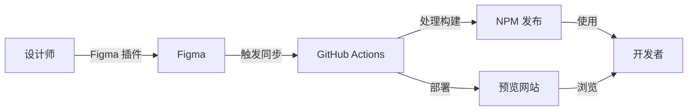
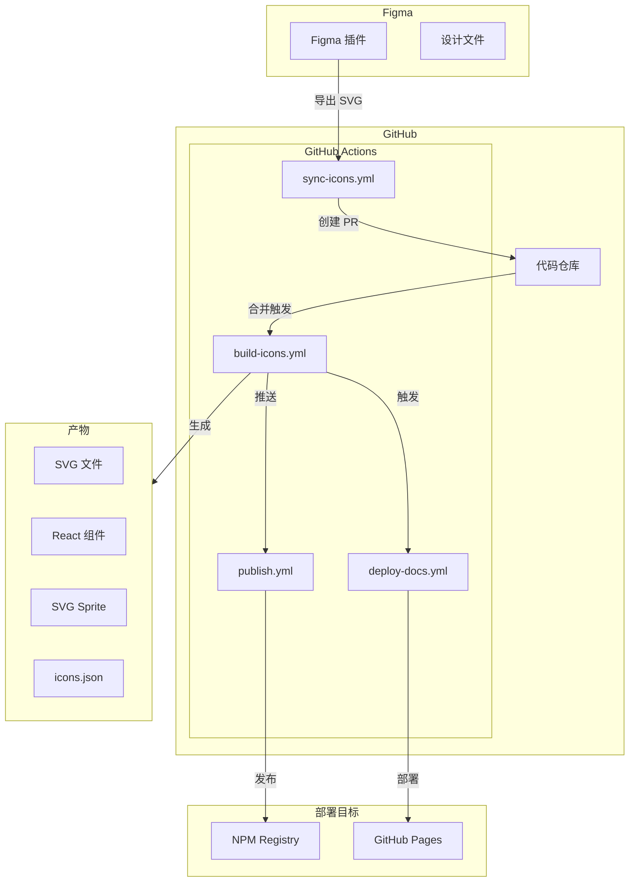
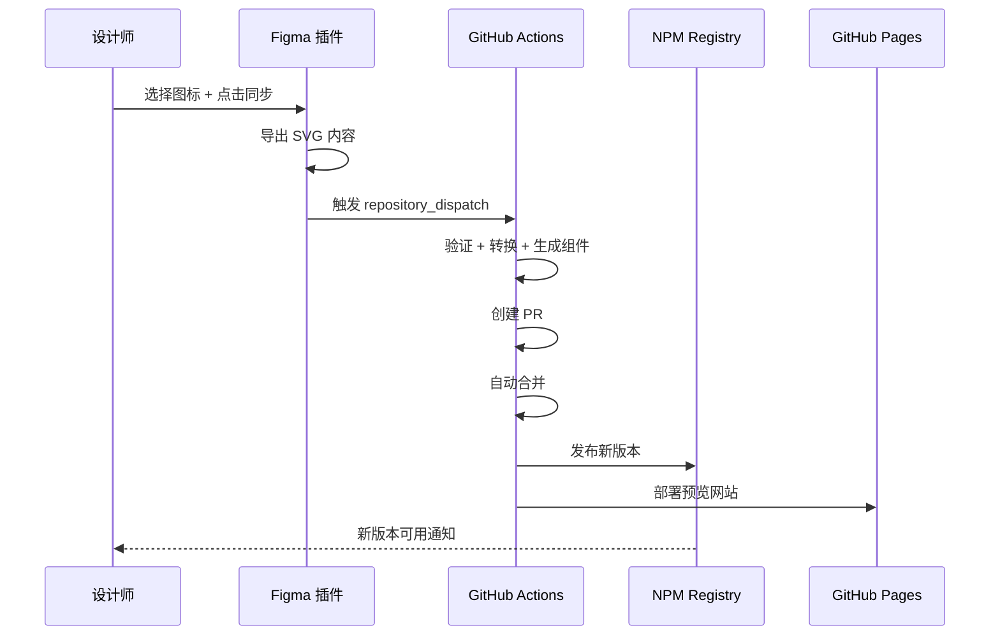
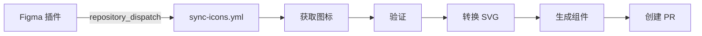

# zleap-icon 项目文档

> 一套完整的 Figma 图标自动化工作流系统，实现从 Figma 设计到 NPM 发布的全自动化流程。

---

## 📋 目录

- [项目概述](#项目概述)
- [架构设计](#架构设计)
- [核心模块](#核心模块)
- [工作流详解](#工作流详解)
- [目录结构](#目录结构)
- [技术栈](#技术栈)
- [配置说明](#配置说明)

---

## 项目概述

### 功能特性

| 功能 | 描述 |
|------|------|
| **Figma 插件** | 设计师一键触发图标同步，支持选区同步 |
| **自动化工作流** | GitHub Actions 自动处理图标转换和发布 |
| **React 组件** | 自动生成 TypeScript React 图标组件 |
| **多格式输出** | React 组件、SVG、SVG Sprite、JSON 元数据 |
| **预览网站** | 自动部署到 GitHub Pages 的图标预览站点 |
| **规范校验** | 自动检查图标尺寸、命名和 SVG 特性 |
| **自动 Changelog** | 自动生成版本变更日志 |

### 核心价值



---

## 架构设计

### 整体架构



### 数据流



---

## 核心模块

### 1. Figma 插件 (`figma-plugin/`)

Figma 插件是整个自动化流程的入口，负责：

- 扫描并识别设计文件中的图标组件
- 支持选区同步（只同步选中的图标）
- 直接在插件中导出 SVG 内容（避免 API 限速）
- 触发 GitHub Actions 工作流

**核心文件**：

| 文件 | 说明 |
|------|------|
| [code.ts](file:///Users/ruofeng/Documents/Web/zleap/zleap_icon/figma-plugin/code.ts) | 插件主逻辑，处理图标识别和导出 |
| [ui.html](file:///Users/ruofeng/Documents/Web/zleap/zleap_icon/figma-plugin/ui.html) | 插件 UI 界面 |
| [manifest.json](file:///Users/ruofeng/Documents/Web/zleap/zleap_icon/figma-plugin/manifest.json) | 插件配置 |

**图标识别规则**：

- 节点类型：COMPONENT 或 FRAME
- 尺寸范围：8-256 px
- 宽高比：0.5-2（接近正方形）
- 包含矢量内容（VECTOR、ELLIPSE、RECTANGLE 等）

---

### 2. 核心脚本 (`scripts/`)

| 脚本 | 功能 | 入口命令 |
|------|------|----------|
| [fetch-icons.ts](file:///Users/ruofeng/Documents/Web/zleap/zleap_icon/scripts/fetch-icons.ts) | 从 Figma API 获取图标 | `npm run fetch-icons` |
| [validate-icons.ts](file:///Users/ruofeng/Documents/Web/zleap/zleap_icon/scripts/validate-icons.ts) | 验证图标规范 | `npm run validate-icons` |
| [transform-svg.ts](file:///Users/ruofeng/Documents/Web/zleap/zleap_icon/scripts/transform-svg.ts) | 优化和转换 SVG | `npm run transform-svg` |
| [generate-components.ts](file:///Users/ruofeng/Documents/Web/zleap/zleap_icon/scripts/generate-components.ts) | 生成 React 组件 | `npm run generate-components` |
| [generate-outputs.ts](file:///Users/ruofeng/Documents/Web/zleap/zleap_icon/scripts/generate-outputs.ts) | 生成 Sprite 和元数据 | `npm run generate-outputs` |
| [generate-changelog.ts](file:///Users/ruofeng/Documents/Web/zleap/zleap_icon/scripts/generate-changelog.ts) | 生成变更日志 | `npm run generate-changelog` |

---

### 3. 源码模块 (`src/`)

| 模块 | 功能 |
|------|------|
| [figma-client.ts](file:///Users/ruofeng/Documents/Web/zleap/zleap_icon/src/figma-client.ts) | Figma API 客户端，支持重试和错误处理 |
| [icon-filter.ts](file:///Users/ruofeng/Documents/Web/zleap/zleap_icon/src/icon-filter.ts) | 图标过滤和筛选逻辑 |
| [icon-validator.ts](file:///Users/ruofeng/Documents/Web/zleap/zleap_icon/src/icon-validator.ts) | 图标规范验证器 |
| [svg-transformer.ts](file:///Users/ruofeng/Documents/Web/zleap/zleap_icon/src/svg-transformer.ts) | SVG 优化和转换 |
| [svg-exporter.ts](file:///Users/ruofeng/Documents/Web/zleap/zleap_icon/src/svg-exporter.ts) | SVG 批量导出 |
| [component-generator.ts](file:///Users/ruofeng/Documents/Web/zleap/zleap_icon/src/component-generator.ts) | React 组件生成器 |
| [multi-format-output.ts](file:///Users/ruofeng/Documents/Web/zleap/zleap_icon/src/multi-format-output.ts) | 多格式输出（Sprite、JSON 等） |
| [manifest-generator.ts](file:///Users/ruofeng/Documents/Web/zleap/zleap_icon/src/manifest-generator.ts) | 图标清单生成 |
| [changelog-generator.ts](file:///Users/ruofeng/Documents/Web/zleap/zleap_icon/src/changelog-generator.ts) | 变更日志生成 |
| [version-manager.ts](file:///Users/ruofeng/Documents/Web/zleap/zleap_icon/src/version-manager.ts) | 版本管理 |
| [types.ts](file:///Users/ruofeng/Documents/Web/zleap/zleap_icon/src/types.ts) | TypeScript 类型定义 |

---

## 工作流详解

### GitHub Actions 工作流

#### 1. sync-icons.yml（图标同步）

**触发条件**: `repository_dispatch` 事件（Figma 插件触发）



**主要步骤**：
1. 从 Figma API 获取图标 (`npm run fetch-icons`)
2. 验证图标规范 (`npm run validate-icons`)
3. 转换 SVG (`npm run transform-svg`)
4. 生成 React 组件 (`npm run generate-components`)
5. 生成 Sprite 和元数据 (`npm run generate-outputs`)
6. 更新 Changelog (`npm run generate-changelog`)
7. 创建 Pull Request

---

#### 2. build-icons.yml（图标构建）

**触发条件**：
- `repository_dispatch` 事件 (`icon_build`)
- `svg/` 目录变更推送到 main
- PR 合并到 main
- 手动触发

**主要步骤**：
1. 验证和转换图标
2. 生成 React 组件和输出
3. 更新 Changelog 和版本号
4. 构建 ESM/CJS/类型定义 (`npm run build`)
5. 提交并推送变更
6. 自动合并相关 PR

---

#### 3. publish.yml（NPM 发布）

**触发条件**: `src/` 或 `package.json` 变更推送到 main

**主要步骤**：
1. 运行测试 (`npm test`)
2. 构建所有格式 (`npm run build:esm/cjs/types`)
3. 检查 NPM 版本是否已存在
4. 发布到 NPM (`npm publish --access public --provenance`)
5. 创建 GitHub Release

---

#### 4. deploy-docs.yml（部署预览网站）

**触发条件**：
- `docs/`、`src/icons/`、`svg/`、`icons.json` 变更推送到 main
- 其他工作流完成后触发
- 手动触发

**主要步骤**：
1. 检查和同步图标文件
2. 构建预览网站 (`npm run build:docs`)
3. 部署到 GitHub Pages

---

## 目录结构

```
zleap_icon/
├── .github/workflows/           # GitHub Actions 工作流
│   ├── sync-icons.yml           # 图标同步工作流
│   ├── build-icons.yml          # 图标构建工作流
│   ├── publish.yml              # NPM 发布工作流
│   └── deploy-docs.yml          # 预览网站部署
│
├── figma-plugin/                # Figma 插件
│   ├── code.ts                  # 插件主逻辑
│   ├── ui.html                  # 插件 UI
│   ├── manifest.json            # 插件配置
│   └── README.md                # 插件文档
│
├── src/                         # 核心源码
│   ├── icons/                   # 生成的 React 图标组件
│   ├── figma-client.ts          # Figma API 客户端
│   ├── icon-filter.ts           # 图标过滤逻辑
│   ├── icon-validator.ts        # 图标验证器
│   ├── svg-transformer.ts       # SVG 转换器
│   ├── component-generator.ts   # 组件生成器
│   ├── multi-format-output.ts   # 多格式输出
│   ├── index.ts                 # 主导出文件
│   └── types.ts                 # 类型定义
│
├── scripts/                     # 处理脚本
│   ├── fetch-icons.ts           # 获取图标
│   ├── validate-icons.ts        # 验证图标
│   ├── transform-svg.ts         # 转换 SVG
│   ├── generate-components.ts   # 生成组件
│   ├── generate-outputs.ts      # 生成输出
│   └── generate-changelog.ts    # 生成日志
│
├── svg/                         # 原始 SVG 文件
├── sprite/                      # SVG Sprite
│   └── icons.svg                # Sprite 文件
├── dist/                        # 编译输出
│   ├── esm/                     # ES Modules
│   ├── cjs/                     # CommonJS
│   └── types/                   # 类型定义
│
├── docs/                        # 预览网站源码
│   ├── index.html               # 入口页面
│   ├── main.js                  # 主脚本
│   ├── styles.css               # 样式
│   └── dist/                    # 构建输出
│
├── tests/                       # 测试文件
├── icons.json                   # 图标元数据
├── icons-manifest.json          # 图标清单
├── CHANGELOG.md                 # 变更日志
└── package.json                 # 项目配置
```

---

## 技术栈

| 类别 | 技术 |
|------|------|
| **语言** | TypeScript |
| **运行时** | Node.js 20 |
| **包管理** | npm |
| **构建** | TypeScript Compiler (tsc) |
| **SVG 优化** | SVGO |
| **测试** | Vitest |
| **文档站点** | Vite |
| **CI/CD** | GitHub Actions |
| **部署** | GitHub Pages, NPM Registry |

---

## 配置说明

### 环境变量

| 变量 | 说明 | 必需 |
|------|------|------|
| `FIGMA_TOKEN` | Figma Personal Access Token | ✅ |
| `FIGMA_FILE_KEY` | Figma 文件 Key | ✅ |
| `NPM_TOKEN` | NPM 发布 Token | ✅ (发布时) |
| `NODE_IDS` | 指定导出的节点 ID（逗号分隔） | ❌ |
| `VERSION` | 版本号 | ❌ |
| `MESSAGE` | 更新消息 | ❌ |
| `OUTPUT_DIR` | SVG 输出目录（默认 `./svg`） | ❌ |
| `MANIFEST_PATH` | 清单文件路径（默认 `./icons-manifest.json`） | ❌ |

### GitHub Secrets

需要在仓库设置中配置以下 Secrets：

- `FIGMA_TOKEN` - Figma API Token
- `NPM_TOKEN` - NPM 发布 Token

---

## 相关文档

| 文档 | 说明 |
|------|------|
| [配置指南](file:///Users/ruofeng/Documents/Web/zleap/zleap_icon/docs/CONFIGURATION.md) | GitHub Secrets、Figma 插件、图标规范、构建配置 |
| [部署指南](file:///Users/ruofeng/Documents/Web/zleap/zleap_icon/docs/DEPLOYMENT.md) | 完整的部署流程和故障排除 |
| [开发指南](file:///Users/ruofeng/Documents/Web/zleap/zleap_icon/docs/DEVELOPMENT.md) | 本地开发、测试和贡献指南 |
| [Figma 插件](file:///Users/ruofeng/Documents/Web/zleap/zleap_icon/figma-plugin/README.md) | 插件安装、配置和使用方法 |
| [测试指南](file:///Users/ruofeng/Documents/Web/zleap/zleap_icon/docs/TESTING-GUIDE.md) | 测试策略和执行方法 |
| [同步模式](file:///Users/ruofeng/Documents/Web/zleap/zleap_icon/docs/SYNC-MODES.md) | 不同的图标同步模式说明 |
| [故障排除](file:///Users/ruofeng/Documents/Web/zleap/zleap_icon/docs/TROUBLESHOOTING.md) | 常见问题解答 |
